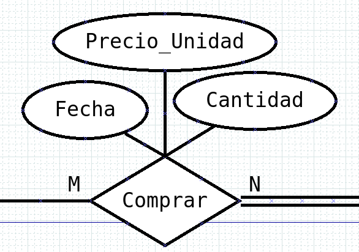
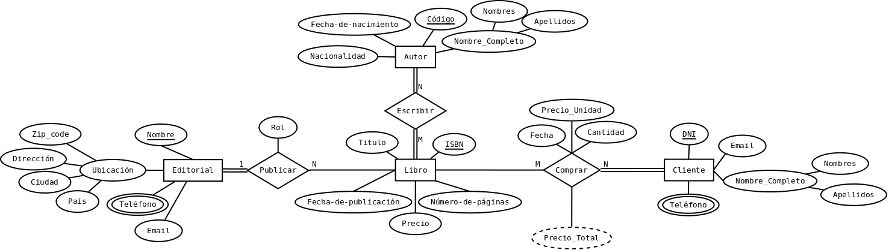
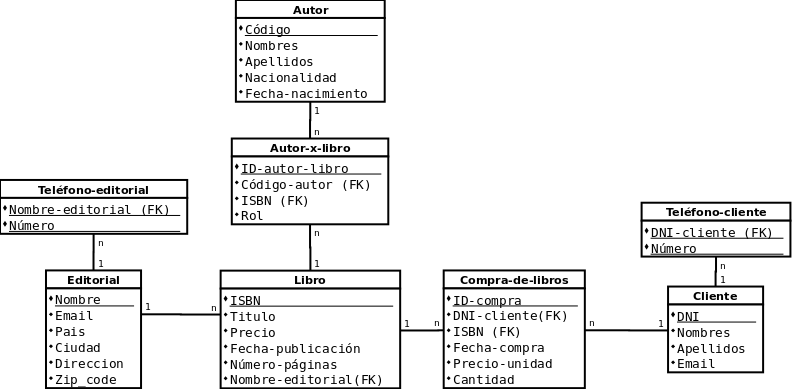

# Correcciones

Por: Jesus David Bonelo Cuellar

## Atributos clave

- Los atributos clave pueden ser simplificados como:
  - `Nombre-editorial` -> `Nombre`
  - `Código-Autor` -> `Código`
  - `DNI-cliente` -> `DNI`

## Relaciones muchos a muchos

- En las tablas intermedias se agregaron campos en la tabla, estos deberían estar reflejados en el modelo E-R como atributos de la relación, o en caso de ser muchos es mejor utilizar una entidad intermedia.

- **Observación:** La tabla intermedia entre clientes y libros comprados tiene el campo `Cantidad` y `Precio-unitario`, sin embargo solo puede tener la llave foranea de **un libro**. Esto indicaría que el modelo de negocio es que por cada id de compra solo puede ir un libro y pueden ser varias unidades del mismo.

## Entidad editorial

- Las Editoriales pueden estar ubicadas en diferentes países, por lo tanto, para facilitar la ubicación de una dirección internacional se puede agregar el atributo `zip_code`.

## [MER-libreria-corregido.dia](./MER-libreria-corregido.dia)

## 

## [ModeloRelacionalLibreriaCorregido.dia](./ModeloRelacionalLibreriaCorregido.dia)

## 

## [EER-libreria.mwb](./EER-libreria.mwb)

## 
