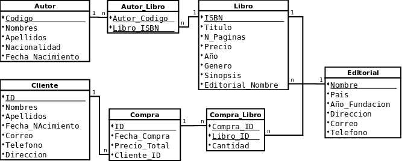
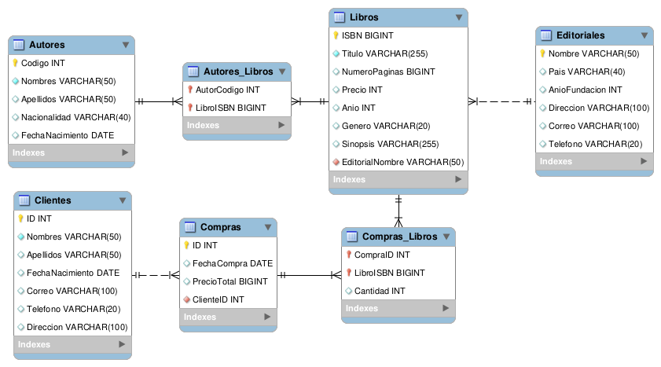

# Solución Taller #3 Comandos SQL

## Primera actividad:

### Entidades y sus atributos

1. **Editorial:**
   - Nombre (Llave)
   - País
   - Año_Fundación
   - Dirección
   - Correo
   - Teléfono
2. **Autor:**
   - Código (Llave)
   - Nombre_Completo (Compuesto de: Nombres, Apellidos)
   - Nacionalidad
   - Fecha_Nacimiento
3. **Libro:**
   - ISBN (Llave)
   - Título
   - Número_Páginas
   - Precio
   - Año
   - Género
   - Sinopsis
4. **Cliente:**
   - ID (Llave)
   - Nombre_Completo (Compuesto de: Nombres, Apellidos)
   - Fecha_Nacimiento
   - Edad (Derivado)
   - Correo
   - Teléfono
   - Dirección
5. **Compra:**
   - ID (Llave)
   - Fecha_Compra
   - ISBN_Libro
   - ID_Cliente
   - Cantidad
   - Precio_Total

### Relaciones, cardinalidad y participación

#### Muchos a Muchos

- Un libro puede **ser escrito por muchos** autores y un autor puede **escribir muchos** libros. Un libro **debe ser escrito mínimo por un** autor, y un autor **debe haber escrito** almenos un libro.
- Una compra puede **contener muchos** libros y un libro puede **ser vendido en varias** compras. Una compra **debe contener al menos un** libro, mientras que un libro puede **no estar contenido en ninguna** compra.

#### Uno a Muchos

- Una editorial puede **publicar muchos** libros y un libro puede **ser publicado por solo una** editorial. Una editorial **puede no haber publicado** libros que la librería tenga, y un libro **debe ser publicado por una** editorial.
- Un cliente puede **realizar muchas** compras, pero una compra puede **ser realizada por un solo** cliente. Un cliente **tiene que haber realizado una** compra y una compra **debe ser realizada por un** cliente.

### Modelo Entidad-Relación

[MER_Librería.dia](./MER_Librería.dia)


### Modelo Relacional

[MR_Librería.dia](./MR_Librería.dia)


---

[Instalando MySQL](./img/mysql-docker-install.png)

[Conexión por workbench](./img/conexión-workbench.png)

### Diagrama en Workbench


[Diagrama .mwb](./ModeloWorkbench_Libreria.mwb)

### Definición de la base de datos en SQL

[bookstore_schema.sql](./bookstore_schema.sql)

```sql

# Borrar base de datos
# drop database bookstore;

# Crear base de datos
create database if not exists bookstore;

use bookstore;

# Crear tablas sin referencias
CREATE TABLE IF NOT EXISTS Autores (
    Codigo INT NOT NULL PRIMARY KEY,
    Nombres VARCHAR(50) not null,
    Apellidos VARCHAR(50),
    Nacionalidad VARCHAR(40),
    FechaNacimiento DATE
)  ENGINE=INNODB;

CREATE TABLE IF NOT EXISTS Clientes (
    ID INT NOT NULL PRIMARY KEY,
    Nombres VARCHAR(50) not null,
    Apellidos VARCHAR(50),
    FechaNacimiento DATE,
    Correo varchar(100),
    Telefono varchar(20),
    Direccion varchar(100)
)  ENGINE=INNODB;

CREATE TABLE IF NOT EXISTS Editoriales (
    Nombre VARCHAR(50) NOT NULL PRIMARY KEY,
    Pais VARCHAR(40),
    AnioFundacion INT,
    Direccion VARCHAR(100),
    Correo VARCHAR(100),
    Telefono VARCHAR(20)
)  ENGINE=INNODB;

# Crear tablas con llave foranea
CREATE TABLE IF NOT EXISTS Libros (
    ISBN BIGINT NOT NULL PRIMARY KEY,
    Titulo VARCHAR(255) NOT NULL,
    NumeroPaginas BIGINT,
    Precio INT,
    Anio INT,
    Genero VARCHAR(30),
    Sinopsis VARCHAR(255),
    EditorialNombre VARCHAR(50) NOT NULL,
    FOREIGN KEY (EditorialNombre)
        REFERENCES Editoriales (Nombre)
)  ENGINE=INNODB;

CREATE TABLE IF NOT EXISTS Compras (
    ID INT NOT NULL PRIMARY KEY,
    FechaCompra DATE,
    PrecioTotal BIGINT,
    ClienteID INT not null,
    FOREIGN KEY (ClienteID)
        REFERENCES Clientes (ID)
)  ENGINE=INNODB;

# Crear tablas intermedias de relaciones muchos a muchos
CREATE TABLE IF NOT EXISTS Autores_Libros (
    AutorCodigo INT NOT NULL,
    LibroISBN BIGINT NOT NULL,
    PRIMARY KEY (AutorCodigo , LibroISBN),
    FOREIGN KEY (AutorCodigo)
        REFERENCES Autores (Codigo),
    FOREIGN KEY (LibroISBN)
        REFERENCES Libros (ISBN)
)  ENGINE=INNODB;

CREATE TABLE IF NOT EXISTS Compras_Libros (
    CompraID INT NOT NULL,
    LibroISBN BIGINT NOT NULL,
    Cantidad INT,
    PRIMARY KEY (CompraID , LibroISBN),
    FOREIGN KEY (CompraID)
        REFERENCES Compras (ID),
    FOREIGN KEY (LibroISBN)
        REFERENCES Libros (ISBN)
)  ENGINE=INNODB;
```

## Poblado de la base de datos

Script [populate_booksotre.sql](./populate_booksotre.sql)
